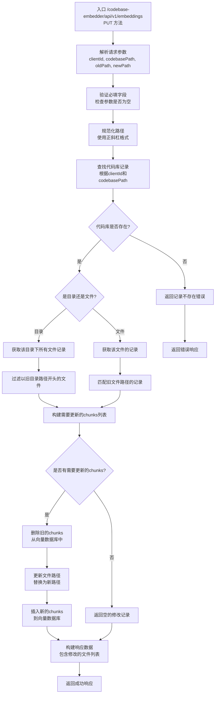

```mermaid
flowchart TD
    A[入口 /codebase-embedder/api/v1/embeddings<br>PUT 方法] --> B[解析请求参数<br>clientId, codebasePath, oldPath, newPath]
    B --> C[验证必填字段<br>检查参数是否为空]
    C --> D[规范化路径<br>使用正斜杠格式]
    D --> E[查找代码库记录<br>根据clientId和codebasePath]
    E --> F{代码库是否存在?}
    F -->|否| G[返回记录不存在错误]
    F -->|是| H{是目录还是文件?}
    H -->|目录| I[获取该目录下所有文件记录]
    H -->|文件| J[获取该文件的记录]
    I --> K[过滤以旧目录路径开头的文件]
    J --> L[匹配旧文件路径的记录]
    K --> M[构建需要更新的chunks列表]
    L --> M
    M --> N{是否有需要更新的chunks?}
    N -->|否| O[返回空的修改记录]
    N -->|是| P[删除旧的chunks<br>从向量数据库中]
    P --> Q[更新文件路径<br>替换为新路径]
    Q --> R[插入新的chunks<br>到向量数据库]
    R --> S[构建响应数据<br>包含修改的文件列表]
    O --> S
    G --> T[返回错误响应]
    S --> U[返回成功响应]
```